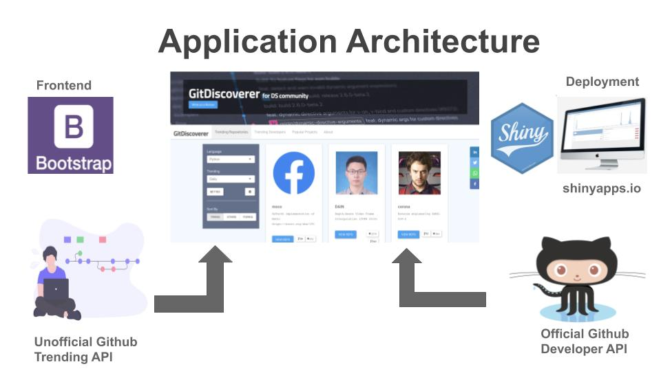
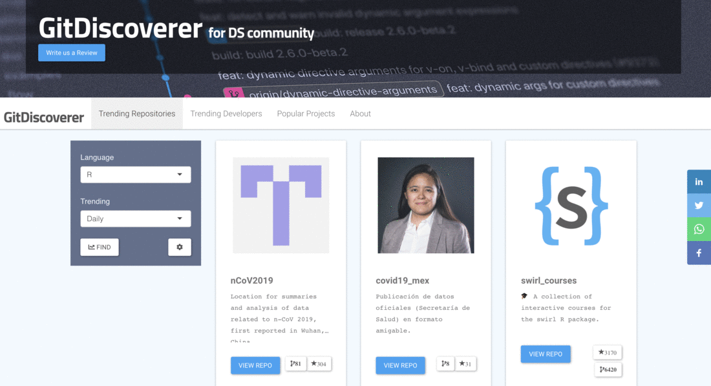
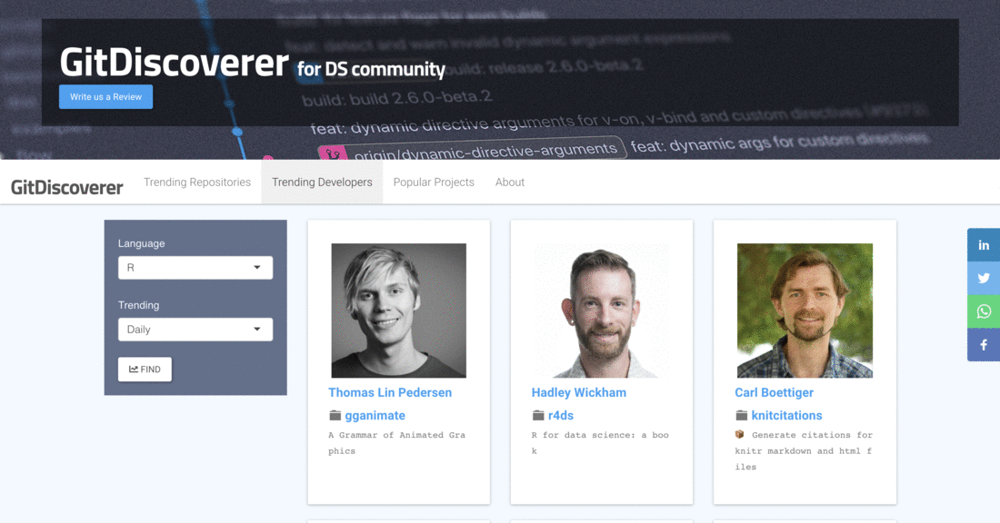
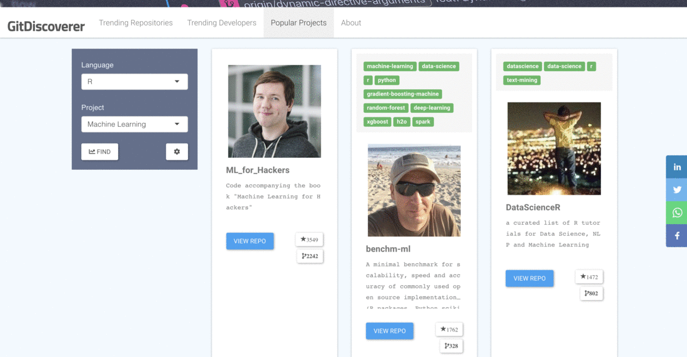

### Quick Overview

This project is re-work of [gitdiscoverer.com](https://rajkstats.shinyapps.io/rstudio-shiny-contest/) which is the first shiny web app I built as part of Rstudio Shiny Contest 2019. Idea of re-building this to try out skills I learned over past year. I have improved my front-end skills which I'm putting in to use here and added few features which might be useful for end users.

### What's new?

- Browse Popular Machine Learning and Deep Learning (ML/DL) Projects on Github
- Topic Tags (Available in Trending Repositories, Popular Projects tabs)
- Dynamically Rendering Info in Bootstrap cards component
- Sort By Trend, Stars, and Forks
- Disconnect screen for Shiny Server

### Architecture 

   

### REST APIs 

* [Github Official Developer API](https://developer.github.com/v3/)  
* [Github Unofficial Trending API](https://github.com/huchenme/github-trending-api)  
      * [Trending Repositories](https://github-trending-api.now.sh/repositories?language=R&since=weekly)  
      * [Trending Developers](https://github-trending-api.now.sh/developers?language=R&since=weekly)

### Instructions 

In order to run this app, Github provides REST API access to get variety of the data of your projects at Github. Since we are only interested in publicly available data. We will Authenticate with OAuth 2.0 which is the most secure option. 

In order to use OAuth option, you need **Client ID** and **Client Secret**. If you don’t have them yet, go to 

1. [Github Developers settings page](https://github.com/settings/developers) , then **Oauth Applications** 
2.  **Register a new Application** say

 > Application Name: **Rstudio Shiny Contest 2020**  
 > Homepage URL : http://github.com  
 > Application description : Rstudio Shiny Contest 2020  
 > Authorization callback URL : http://localhost:1410 

On this page, you should be able to see Client key and Client Secret. Once you have the keys put them in **global.R** of this Shiny App and make sure you have active internet connection and you're all set to run **GitDiscoverer**.

>> [More Detailed Explanation to Generate Keys at this Link](https://blog.exploratory.io/extract-data-from-private-github-repository-with-rest-api-db804fa43d84)

#### **Reproducibility at RstudioCloud Server**

In order to reproduce this app at rstudio cloud server, you will need to generate oauth tokens. In my case, I was getting an error which says bad credentials and error in callback url
was error in uri redirect mismatch. Please follow the instructions at [rstudio support link](https://support.rstudio.com/hc/en-us/articles/217952868-Generating-OAuth-tokens-from-a-server) 

There are few steps to try on the ticket,  but the one which worked for me on rstudio cloud server:

> Create the .httr-oauth token on your desktop and then copy the file to a server

### App Workflow

&nbsp;

Tab 1 - **Trending Repositories**

 

   
 

&nbsp;

Tab 2 - **Trending Developers**

 

   
 

 
 &nbsp;

Tab 2 - **Popular Projects**

 

   
 

 

 &nbsp;
 
### Credits

* [Unsplash: Jumbotron Image](https://unsplash.com/photos/842ofHC6MaI)
* [Shiny CheatSheet](https://shiny.rstudio.com/images/shiny-cheatsheet.pdf)  
* This artcile helped me [Kdnuggets: Trending Top Deep Learning Repositories](https://www.kdnuggets.com/2019/02/trending-top-deep-learning-github-repositories.html) in building popular projects tab. 
* [GifMaker for Gifs](https://gifmaker.me/)

### Learn More 

Check out this [Linkedin Article]() I wrote.

### Contact

- For any comments or questions, please email me at raj.k.stats@gmail.com
- For Feature request/ improvements, Please open an issue [here](https://github.com/rajkstats/git_discoverer_app/issues)
